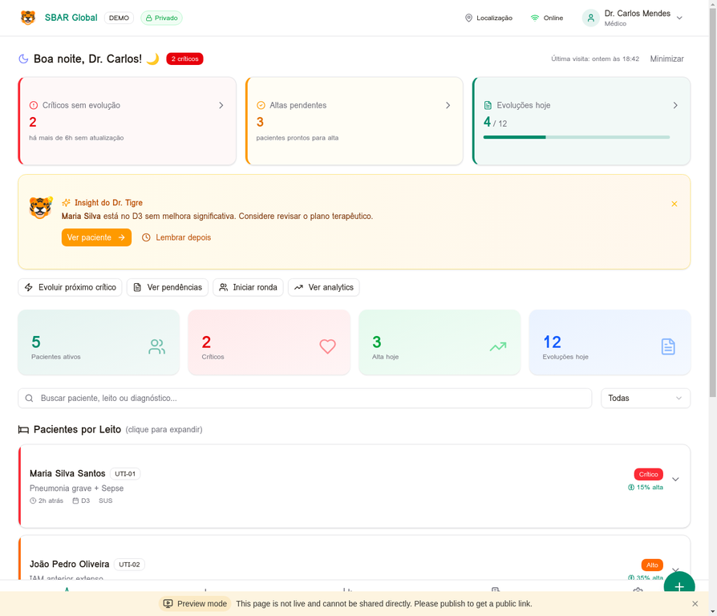
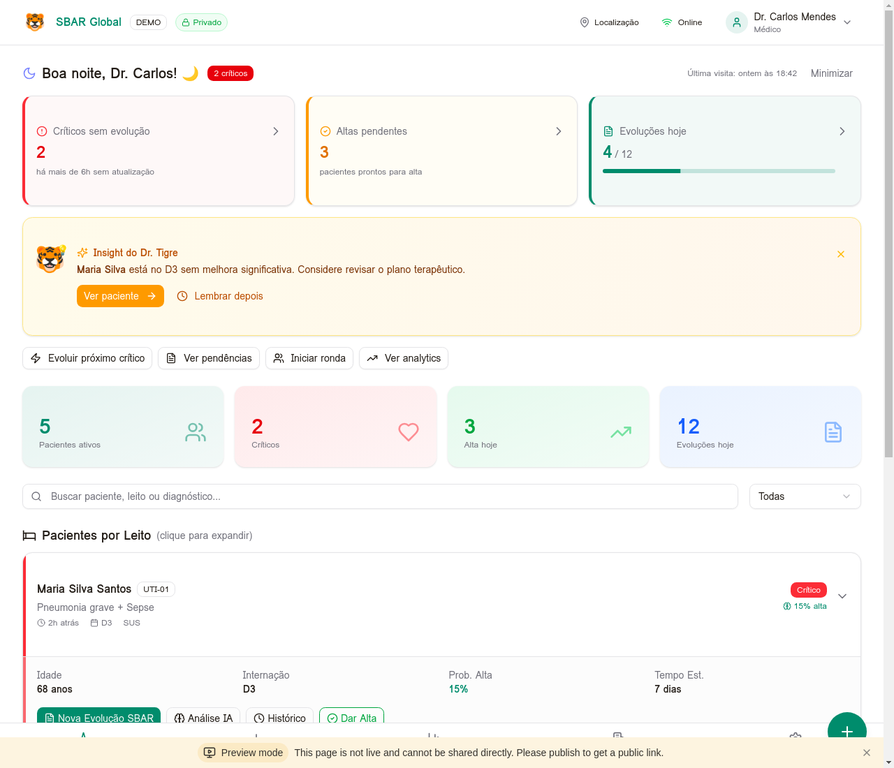
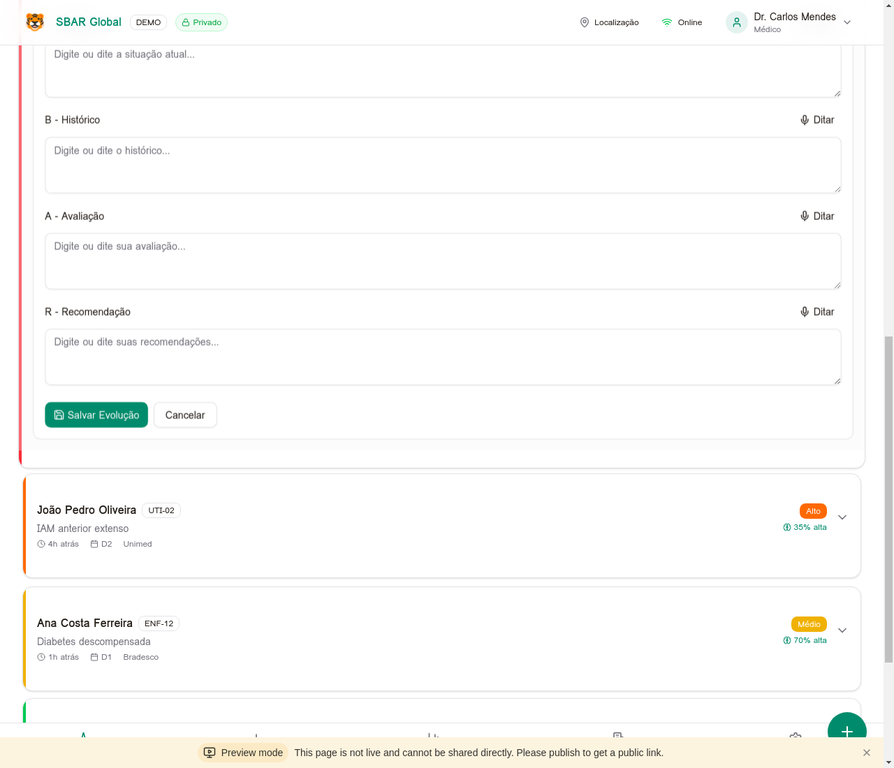
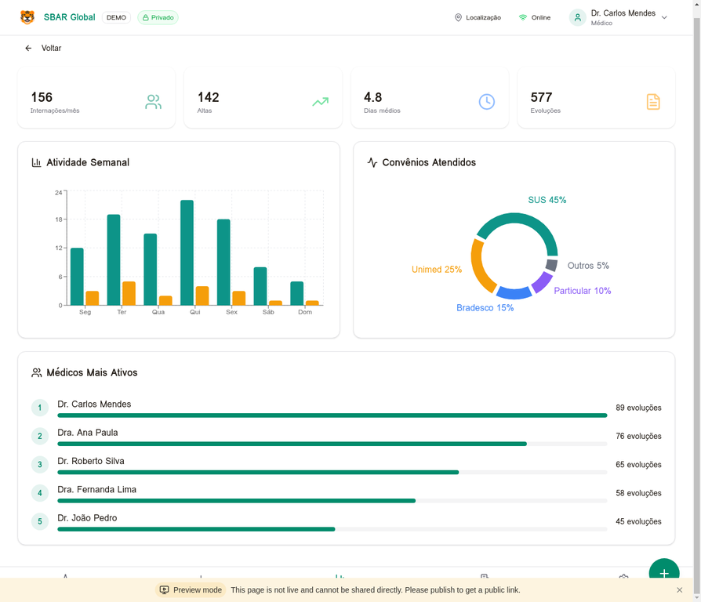
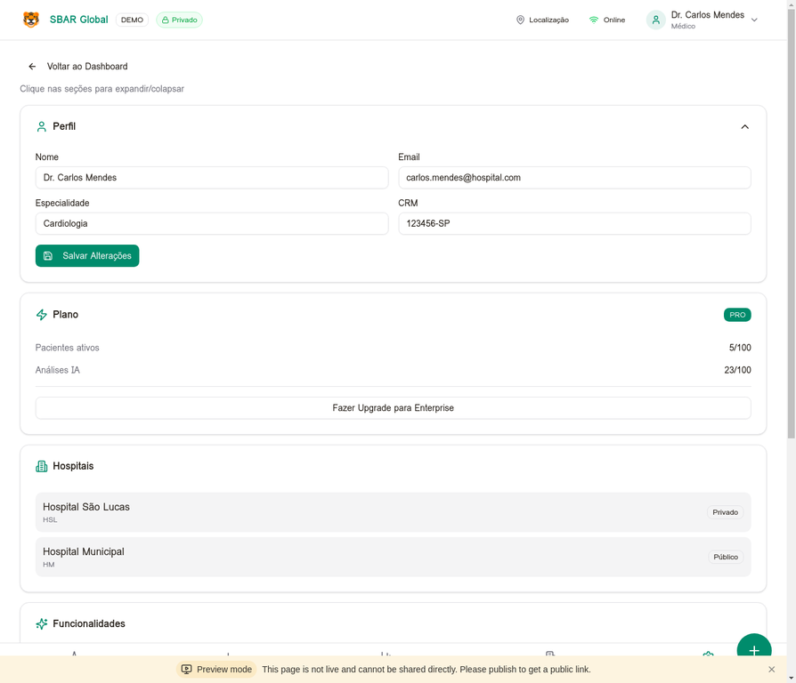
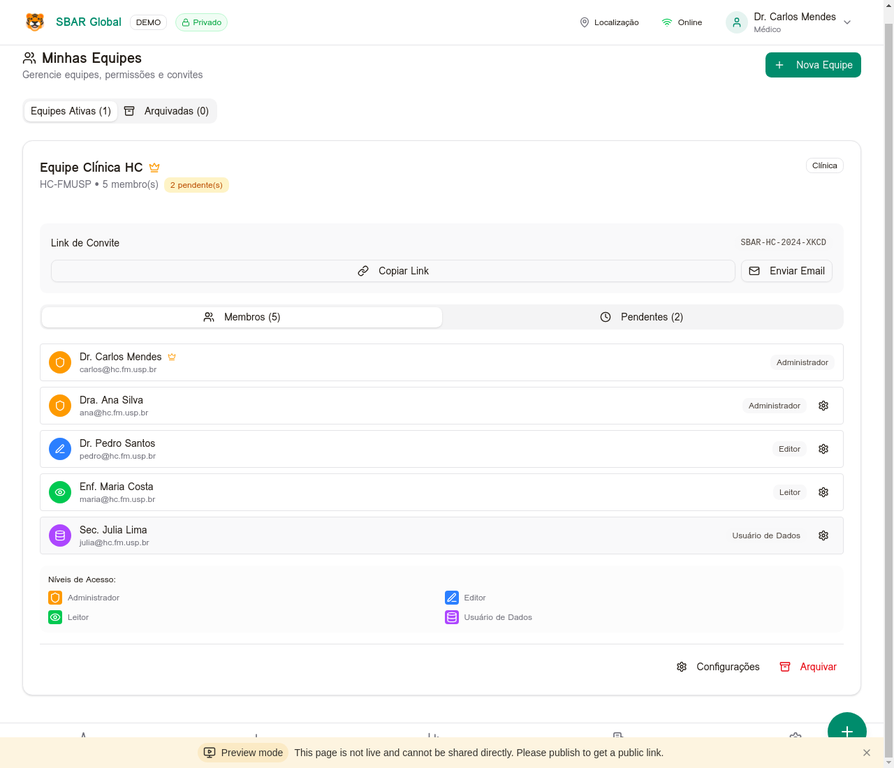
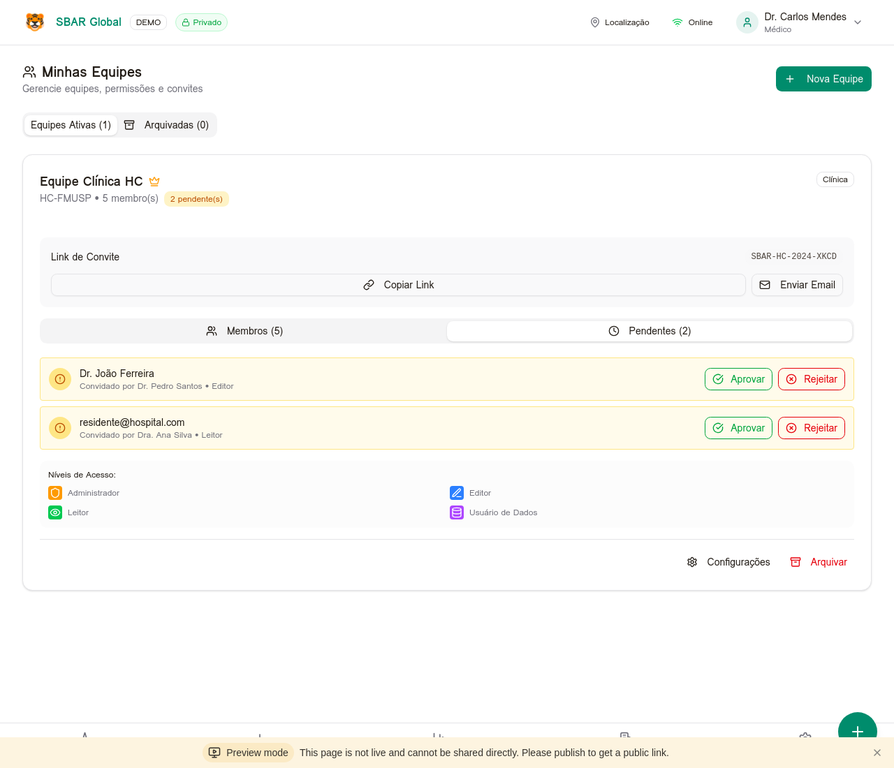

# SBAR Global - Apresentação do Produto

## Visão Geral

O **SBAR Global** é uma plataforma de inteligência clínica que revoluciona a comunicação médica através do protocolo SBAR (Situação, Background, Avaliação, Recomendação). O sistema foi projetado para médicos, enfermeiros e equipes de saúde que precisam documentar evoluções de pacientes de forma rápida, estruturada e segura.

---

## 1. Dashboard Principal - Morning Brief

### Funcionalidades Destacadas:

**A. Saudação Personalizada**
- Identifica o horário do dia (Bom dia/Boa tarde/Boa noite)
- Mostra nome do médico logado
- Badge com quantidade de pacientes críticos

**B. Cards de Ação Prioritária**
- **Críticos sem evolução**: Pacientes há mais de 6h sem atualização
- **Altas pendentes**: Pacientes prontos para alta médica
- **Evoluções hoje**: Progresso do dia com barra visual

**C. Insight do Dr. Tigre (Mascote)**
- Sugestões proativas baseadas em dados
- Botões de ação rápida: "Ver paciente" / "Lembrar depois"

**D. Quick Actions**
- Evoluir próximo crítico
- Ver pendências
- Iniciar ronda
- Ver analytics

**E. Métricas Resumidas**
- Pacientes ativos
- Críticos
- Alta hoje
- Evoluções hoje

---

## 2. Paciente Expandido

### Informações do Paciente:

**Card do Paciente**
- Nome completo e leito (ex: UTI-01)
- Diagnóstico principal
- Tempo desde última evolução
- Dia de internação (D0, D1, D2...)
- Convênio (SUS, Unimed, Bradesco, Particular)
- Badge de gravidade (Crítico, Alto, Médio, Baixo)
- Probabilidade de alta (%)

**Ações Disponíveis**
- Nova Evolução SBAR
- Análise IA
- Histórico
- Dar Alta

**Dados Adicionais**
- Idade
- Dias de internação
- Probabilidade de alta
- Tempo estimado de permanência

---

## 3. Formulário SBAR

### Estrutura do Formulário:

O formulário segue o protocolo SBAR internacional:

**S - Situação**
- Campo de texto livre
- Botão "Ditar" para entrada por voz

**B - Background (Histórico)**
- Contexto clínico relevante
- Entrada por texto ou voz

**A - Avaliação**
- Análise do médico sobre o quadro
- Entrada por texto ou voz

**R - Recomendação**
- Plano terapêutico e próximos passos
- Entrada por texto ou voz

**Ações**
- Salvar Evolução (botão verde)
- Cancelar

---

## 4. Analytics

### Métricas e Gráficos:

**KPIs Principais**
- 156 Internações/mês
- 142 Altas
- 4.8 Dias médios de internação
- 577 Evoluções totais

**Gráficos**
- **Atividade Semanal**: Gráfico de barras por dia da semana
- **Convênios Atendidos**: Gráfico de rosca com distribuição (SUS 45%, Unimed 25%, Bradesco 15%, Particular 10%, Outros 5%)

**Ranking de Médicos**
- Top 5 médicos mais ativos
- Quantidade de evoluções por médico
- Barras de progresso visuais

---

## 5. Configurações

### Seções de Configuração:

**Perfil do Usuário**
- Nome
- Email
- Especialidade
- CRM

**Plano**
- Badge PRO
- Pacientes ativos: 5/100
- Análises IA: 23/100
- Botão "Fazer Upgrade para Enterprise"

**Hospitais Vinculados**
- Lista de hospitais (Privado/Público)
- Hospital São Lucas (HSL) - Privado
- Hospital Municipal (HM) - Público

**Funcionalidades (Grid de Módulos)**
- Chat da Equipe
- Escala e Ranking
- Planos e Preços
- Dashboard Hospital
- Hospitais
- Equipes
- Convites
- Lembretes
- DRG
- IA Preditor
- Recuperação

---

## 6. Sistema de Equipes e Permissões

### Gerenciamento de Equipes:

**Estrutura**
- Nome da equipe (ex: Equipe Clínica HC)
- Hospital vinculado (HC-FMUSP)
- Quantidade de membros
- Badge de pendentes

**Convites**
- Link de convite único (SBAR-HC-4-XKCD)
- Botão "Copiar Link"
- Botão "Enviar Email"

**Abas**
- Membros (quantidade)
- Pendentes (quantidade)

**Lista de Membros com Papéis**
- Dr. Carlos Mendes - Administrador (coroa de criador)
- Dra. Ana Silva - Administrador
- Dr. Pedro Santos - Editor
- Enf. Maria Costa - Leitor
- Sec. Julia Lima - Usuário de Dados

**Legenda de Níveis de Acesso**
- 🟠 Administrador
- 🟢 Leitor
- 🔵 Editor
- 🟣 Usuário de Dados

**Ações**
- Configurações
- Arquivar

---

## 7. Convites Pendentes

### Fluxo de Aprovação:

**Lista de Pendentes**
- Nome/Email do convidado
- Quem convidou
- Papel sugerido

**Ações por Convite**
- Botão "Aprovar" (verde)
- Botão "Rejeitar" (vermelho)

**Exemplo de Convites**
- Dr. João Ferreira - Convidado por Dr. Pedro Santos • Editor
- residente@hospital.com - Convidado por Dra. Ana Silva • Leitor

---

## Hierarquia de Permissões

| Papel | Pode Fazer | Não Pode Fazer |
|-------|------------|----------------|
| **Administrador** | Tudo + aprovar convites + gerenciar membros + promover admins | - |
| **Editor** | Criar/editar evoluções próprias + convidar (pendente aprovação) | Aprovar convites, gerenciar membros |
| **Leitor** | Visualizar evoluções e dados clínicos | Criar/editar evoluções |
| **Usuário de Dados** | Ver dados não-sensíveis (nome, leito, hospital) | Ver dados clínicos sensíveis |

---

## Tecnologias Utilizadas

- **Frontend**: React 19 + TypeScript + Tailwind CSS 4
- **Backend**: Node.js + Express + tRPC
- **Banco de Dados**: MySQL/TiDB
- **Autenticação**: OAuth 2.0
- **IA**: Integração com LLM para análise de evoluções

---

## Próximos Passos Sugeridos

1. **Sala de Recuperação Cirúrgica**: Monitoramento pós-operatório com escalas (EVA, Aldrete, Ramsay)
2. **WhatsApp Bot**: Receber evoluções via WhatsApp
3. **Notificações Push**: Alertas em tempo real
4. **Transferência de Propriedade**: Permitir que criador transfira equipe para outro admin

---

*Documento gerado em 31/01/2026*
*SBAR Global - Clinical Intelligence Platform*
